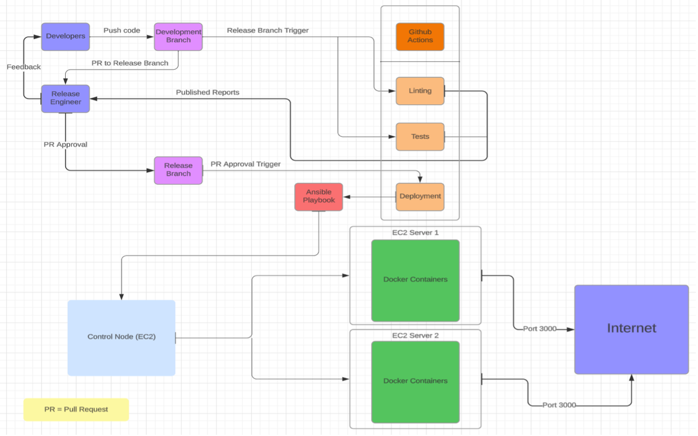

# End-to-End CI/CD Pipeline

Team Members:

Soham Bapat - sbapat2(school) or sohambapat(personal) - sbapat2@ncsu.edu (school) or sohambapat27@gmail.com (personal)

Project Proposal 
  

Automate and Accelerate with Confidence 
 
This continuous deployment pipeline deploys approved changes to all the live servers
automatically. In the DevOps domain, there is a need for reliable and automated continuous
deployment pipelines as it helps in various ways like reducing human errors, faster deployment
cycles and saving time and money.
This pipeline reduces wastage by making it faster and easier for the Release Engineer to publish
changes to live servers after a pull request is accepted in release branch. In a manual
deployment, the release engineer would first manually check the code for any errors like typos,
unused variables, syntax errors etc. and perform tests on the code. This approach is susceptible
to human error. Then manually run the ansible commands to deploy the code on the live
servers given that all tests pass, and the code is error free. Comparatively, the release
engineer’s workload is drastically reduced in an automated deployment as the error checking
and testing is done automatically as well as the deployment to live servers once it is approved.

Use Case: Once the Pull Request (PR) is approved by the Release Engineer, the code is
automatically deployed using Ansible playbook on EC2 Control node to 2 EC2 Worker nodes.

1. Preconditions:
- PR is created to Release branch
- Reports from Linting and Testing are generated

2. Main Flow:
- Release Engineer approves change after reviewing linting and testing reports [S1]
- Provides feedback to developer [S2]
- Once approved, automated scripts execute Ansible playbook on control node [S3]

3. Sub flows:
- [S1] Reviews reports for issues with the code
- [S3] Triggers the Deployment workflow in GitHub Actions and 
- [S3] Uses the Ansible playbook on control node to deploy application to Docker containers on 2 EC2 worker nodes. 

4. Alternative Flows:
- [E1] Based on reports, Release Engineer denies the pull request and provides feedback to developers

Pipeline Design

1.	Developers:
  - Developers push code changes to the Development Branch.
  - Create a pull request into the Release Branch.
2.	Release Branch Trigger:
  - Activated upon the creation of a pull request from Development to Release.
  -	Triggers the following workflows in GitHub Actions:
    -	Linting
    -	Testing
3.	Linting Workflow:
  -	Catches code issues (syntax errors, typos, etc.).
  -	Sends results to the Release Engineer.
  -	Triggered when a pull request is created on any branch.
4.	Testing Workflow:
  -	Conducts various tests (unit testing, performance testing).
  -	Sends results to the Release Engineer.
  -	Triggered when a pull request is created on any branch.
5.	Release Engineer:
  -	Reviews linting and testing results.
  -	Approves or denies the pull request.
  -	Sends feedback to Developers.
6.	PR Approval Trigger:
  -	Activated upon the closure of the pull request by the Release Engineer.
  -	Triggers the Deployment Workflow.
7.	Deployment Workflow:
  -	Logs into Docker Hub
  -	Builds and pushes new docker image to Docker Hub
  -	Runs the Ansible Playbook on the control node.
8.	Ansible Playbook:
  -	Configures Docker containers on worker nodes using latest image pulled from Docker Hub
  -	Exposes port 3000 to the internet as required for the application's functionality.
  -	Triggered by "PR Approval Trigger."
9.	Docker Containers:
  -	Execute instructions from the Ansible Playbook.
  -	Serve as the runtime environment for the application.
Additional Notes:
  -	The control node is responsible for triggering the Ansible Playbook and orchestrating the deployment process.
  -	Worker nodes host Docker containers and execute the deployment instructions.
  -	Port 3000 is exposed to the internet to allow external access to the application.

Folder Structure:
- The Ansible playbook running on the Control node can be found in https://github.com/sohambapat/End-to-End-CI-CD-Pipeline/tree/main/Server%20Files
- The Dockerfile for Docker deployments can be found in https://github.com/sohambapat/End-to-End-CI-CD-Pipeline/tree/main/Server%20Files
- The linting and deployment workflows can be found in https://github.com/sohambapat/End-to-End-CI-CD-Pipeline/tree/main/.github/workflows
